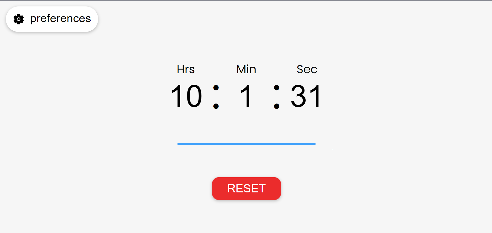

# JS_Timer
A countdown timer made in JavaScript. **[link](https://briantwene.github.io/js_timer/)**

## Features

- Set a time to countdown from
- progress bar that gives a visual representation of the time left

## Languages

Made with:

- HTML
- CSS
- JavaScript

## Soon Coming updates

- Adding Sound to the alert
- Ability to choose from a variety of alert options
- User preferences to be automatically saved
- Dark Mode
